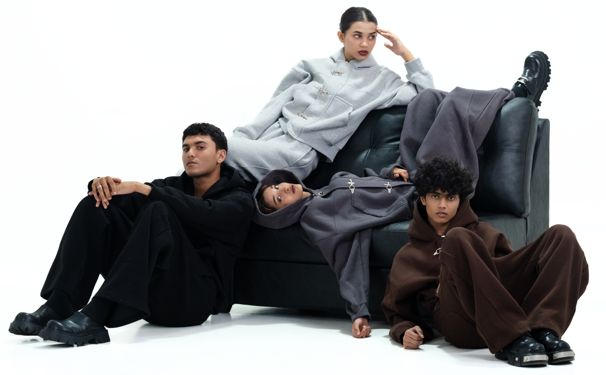

# COLIN GUEST | Luxury Headless E-Commerce

A high-fidelity, headless Shopify store concept designed for premium fashion editorialism. This project focuses on pixel-perfect photography presentation, cinematic motion, and a streamlined "Runway to Cart" user experience.



## Key Features

- **Editorial Collections Hero**: A zero-crop, high-fidelity hero section designed to showcase multi-model photography at its raw master resolution.
- **Cinematic Lookbook**: Infinite looping photography Reels and Scroll-based 3D model physics.
- **Shopify Integration (Draft)**: Structured for headless integration using the Shopify Storefront API.
- **Performance Optimized**: Built with Next.js 15, Turbopack, and `next/image` with unoptimized flags to preserve original creative quality.

## Tech Stack

- **Framework**: Next.js 15 (App Router)
- **Styling**: Tailwind CSS
- **Motion**: Framer Motion
- **State**: Zustand (Persisted)
- **Typography**: Hand-picked Serif and Sans combinations for a luxury editorial aesthetic.

## Getting Started

1. **Clone & Install**:
   ```bash
   git clone https://github.com/zaydabdulla/E-Commerce-website-clothing.git
   npm install
   ```

2. **Development**:
   ```bash
   npm run dev
   ```

3. **Master Quality**: 
   Replace `public/collections_hero.jpg` with your highest resolution master file to maintain the "Retina" creative vision.

---

Designed with 🖤 for COLIN GUEST.
